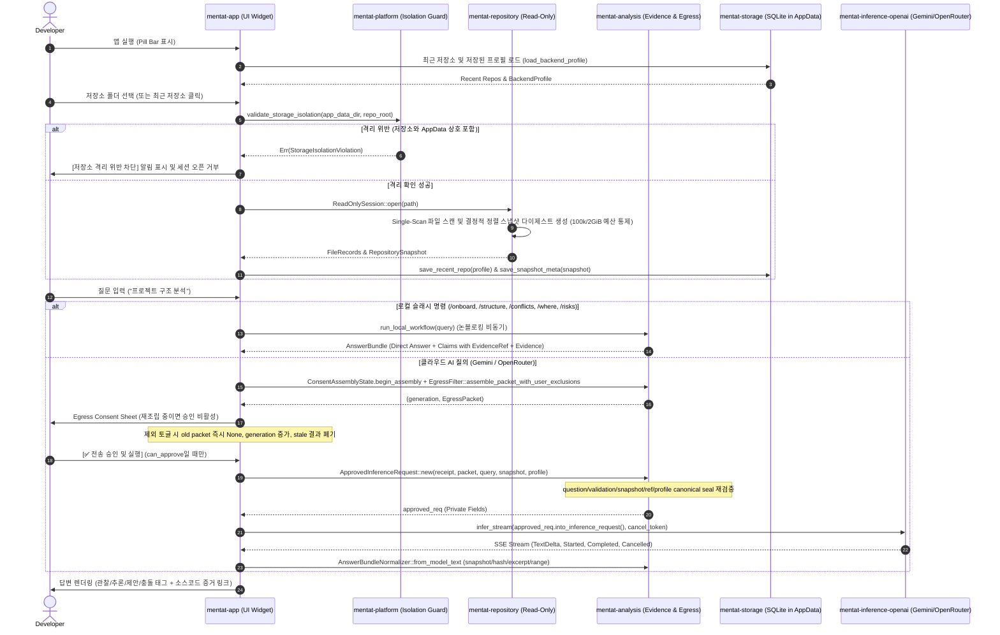

# Code Mentat Implementation Summary (IMPLEMENTATION_SUMMARY.md)
## 코드 멘타트 구현 요약서

- **문서 버전:** 0.1.0-dev (Turn 13 / Re-audit #10 Remediation)
- **패키지 버전:** Cargo workspace `0.1.0` (`0.1.0-dev`는 미릴리스 문서 상태)
- **표준 규격:** AI Implementation Documentation Standard Section 6
- **기준 작성일:** 2026-08-18 (최종 수정: 2026-08-19)

---

## 1. 전체 런타임 흐름 (Runtime Execution Flow)

---

## 2. 모듈별 구현 현황 (Hexagonal Architecture)

| Crate | 역할 | 주요 구현 내용 | 검증 테스트 |
|---|---|---|---|
| `mentat-core` | 도메인 모델 & 포트 | `Claim`, `EvidenceRef`, `RepositoryProfile`, `RepositorySnapshot`, `MentatError` 정의 | - |
| `mentat-platform` | OS 플랫폼 & 격리 가드 | 폴더 선택기, 클립보드 복사, `validate_storage_isolation` (AppData 상호 침범 방지) | `test_storage_isolation_detection` |
| `mentat-repository` | 읽기 전용 저장소 엔진 | Incomplete snapshot, memory gate, ignore-aware watcher, Any/Other/Rescan과 ignore-control fail-closed | `test_dbg_f002_rescan_unknown_and_ignore_control_events_fail_closed`, `test_dbg_f002_git_info_exclude_change_marks_snapshot_stale` |
| `mentat-storage` | AppData SQLite 영속화 | `SqliteStorage`, 최근 저장소, 프로필, 스냅샷, canonical root 조회 | `test_sqlite_storage_save_and_list_recent_repos`, `test_imp_f005_find_repo_by_canonical_root` |
| `mentat-analysis` | 정적 분석 및 유출 통제 | 모든 cloud claim과 ConflictItem evidence invariant, verified answer projection, canonical seal, live hash lineage | `test_imp_f004_cloud_conflict_items_require_unique_valid_evidence`, `test_imp_f004_claim_invariants_reject_empty_duplicate_and_invalid_confidence` |
| `mentat-inference` | 추론 도메인 인터페이스 | 동적 `ModelCatalog`, `ModelVerification`, 하드코딩 없는 `BackendProfile`, URL 검증, 테스트 더블 | `production_profile_does_not_choose_a_hardcoded_model`, `model_catalog_rejects_empty_ids_and_deduplicates_provider_data` |
| `mentat-inference-openai` | 멀티 프로바이더 스트리밍 | Gemini/OpenAI 동적 모델 검색, redirect 차단과 secure client fail-closed, SSE | `gemini_cross_origin_redirect_never_receives_api_key`, `gemini_secure_client_build_failure_blocks_every_network_operation` |
| `mentat-inference-llama` | 미래 온디바이스 계약 | `NativeLlamaContract`, 하드웨어 탐지 스텁 | `test_native_llama_contract_isolated_context_and_kv_cleanup` 등 3개 |
| `mentat-persona` | 페르소나 및 아나운서 | 이모지 글꼴에 의존하지 않는 3가지 페르소나 표시명, 사실 보존 렌더러, 중요도 기반 알림 정책 | `test_persona_rendering_preserves_facts_and_evidence`, `test_announcement_policy_levels` |
| `mentat-app` | eframe 데스크톱 UI | 고대비 스위스 라이트 테마, 고정 trailing/저장소 ellipsis, 명시적 종료 수명주기, Draft/Verified/Active 공급자 상태, incomplete query gate | `long_ascii_repository_name_keeps_trailing_controls_visible_at_640_and_760`, `long_cjk_repository_name_keeps_trailing_controls_visible_at_640_and_760`, `shutdown_cancels_scan_and_stream_tokens` |

### UI 복구 실행 증거 (2026-08-19)

- 수정 전 원인: 프레임리스 투명 창에 앱 종료 동작이 없었고 dark visual의 암묵적 foreground와 작은 명시 글자 크기가 표시 환경에 따라 가독성을 떨어뜨렸다.
- 수정 후 실제 실행: 초기 Tier 1은 불투명 흰색 `760×56`, 설정은 `760×480`, `/onboard` 대화 카드는 `760×360`으로 확장됐고 한글 레이블·상태·버튼이 검정 중심 고대비로 표시됐다.
- 종료 실행 증거: 릴리스 앱의 `종료 ×` 클릭과 `Ctrl+Q` 입력을 각각 수행한 뒤 `Code Mentat` 창이 0개가 됨을 확인했다.
- 폰트 자산: `crates/mentat-app/assets/fonts/NanumGothic-Regular.ttf`와 OFL 1.1 라이선스를 앱 바이너리에 포함한다.

---

## 3. 품질 게이트 검증 결과 (Verification Results)

- **단위/회귀 테스트:** `cargo test --workspace --locked` 실행 증거 (102 passed, 1 ignored 100k/2GiB profile)
- **100k/2GiB profile:** 100,000 files / 2,147,483,648 bytes / preview 3,358,720 bytes / scan 80,377ms / Windows peak working set 46,231,552 bytes / 128MiB threshold (별도 ignored gate PASS)
- **포맷팅 검사:** `cargo fmt --all -- --check` (0 diffs)
- **정적 분석:** `cargo clippy --workspace --all-targets --all-features --locked -- -D warnings` (0 errors, 0 warnings)
- **릴리스 바이너리 빌드:** `cargo build --release -p mentat-app --locked` (완료)
- **Windows UI 런타임:** `760x56` Tier 1에서 우측 `고정`·`설정`·`종료 ×` 순서와 `760x480` 설정 확장, 종료 후 창 0개를 확인. 640/760px 긴 ASCII/CJK geometry는 headless render tests로 검증
- **Windows global shortcut runtime:** 다른 앱 포커스에서 `Ctrl+Alt+M` 전역 event 수신과 Code Mentat 표시 유지/Tier 1 non-hide fallback 확인
- **Baseline 원문 대조:** `CODE_MENTAT_SPEC.md`와 `spec.md`의 FR/NFR/CON 47개 정의·수용 기준, mismatch 0
- **의존성 보안 감사:** `cargo audit --no-fetch --file Cargo.lock` FAIL — `quick-xml 0.30.0` High 2건(`RUSTSEC-2026-0194`, `RUSTSEC-2026-0195`)과 unmaintained 2건. High 2건은 `DEC-SEC-004`의 Windows 비도달 Accepted Risk이며 audit 실패를 PASS로 표기하지 않음
