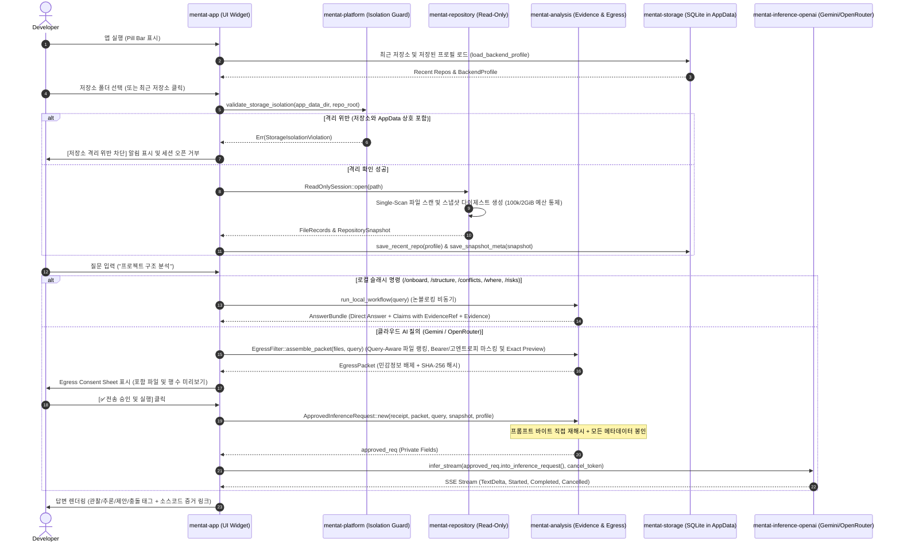

# Code Mentat Implementation Summary (IMPLEMENTATION_SUMMARY.md)
## 코드 멘타트 구현 요약서

- **문서 버전:** 0.1.0-dev (Turn 9 / Re-audit #6 Remediation)
- **표준 규격:** AI Implementation Documentation Standard Section 6
- **기준 작성일:** 2026-08-18 (최종 수정: 2026-08-19)

---

## 1. 전체 런타임 흐름 (Runtime Execution Flow)

---

## 2. 모듈별 구현 현황 (Hexagonal Architecture)

| Crate | 역할 | 주요 구현 내용 | 검증 테스트 |
|---|---|---|---|
| `mentat-core` | 도메인 모델 & 포트 | `Claim`, `EvidenceRef`, `RepositoryProfile`, `RepositorySnapshot`, `MentatError` 정의 | - |
| `mentat-platform` | OS 플랫폼 & 격리 가드 | 폴더 선택기, 클립보드 복사, `validate_storage_isolation` (AppData 상호 침범 방지) | `test_storage_isolation_detection` |
| `mentat-repository` | 읽기 전용 저장소 엔진 | `ReadOnlySession` (Single-Scan `create_snapshot_from_files`, 100k 파일/2GiB 예산 통제), `.gitignore` 필터링, 파일 메타데이터 및 스트리밍 해시, `inspect_file` 심볼릭 정규화 가드, `RepositoryWatcher` (재귀 mtime 검사) | `test_read_only_session_scan_and_snapshot`, `test_external_path_blocked`, `test_sec_f006_inspect_file_canonical_safety` |
| `mentat-storage` | AppData SQLite 영속화 | `SqliteStorage`, 최근 저장소 목록 관리 (`recent_repositories`), `saved_profiles`, `snapshot_history`, 스키마 자동 마이그레이션 | `test_sqlite_storage_save_and_list_recent_repos`, `test_sqlite_storage_save_and_load_backend_profile`, `test_sqlite_storage_save_and_load_snapshot_meta` |
| `mentat-analysis` | 정적 분석 및 유출 통제 | `ProjectDetector`, `SemanticKernel` (/onboard, /structure, /conflicts, /where, /risks 워크플로별 `EvidenceRef` 연계), `EgressFilter` (고엔트로피/Bearer/AWS/JWT/PEM 비밀정보 마스킹, 사용자 제외 파일 지원), `ApprovedInferenceRequest` (단일 소비 계약) | 13개 테스트 패스 |
| `mentat-inference` | 추론 도메인 인터페이스 | `InferenceBackend` trait, `BackendProfile` Redacted Debug & parsed URL loopback validation, `FakeInferenceBackend` | `test_sec_f004_redacted_debug_formatting`, `test_sec_f004_parsed_url_loopback_validation`, `test_fake_inference_cancellation`, `test_fake_inference_stream_completes` |
| `mentat-inference-openai` | 멀티 프로바이더 스트리밍 | Google Gemini (`x-goog-api-key`), OpenRouter (`Bearer`), 사전 응답 취소, 바이트 버퍼 기반 SSE 스트리밍, Fail-Closed 누락 키 및 취소 검증 | `test_multi_provider_adapter_default_initialization`, `test_gemini_and_openai_missing_key_infer_fail_closed`, `test_pre_response_cancellation_aborts_immediately` |
| `mentat-inference-llama` | 미래 온디바이스 계약 | `NativeLlamaContract`, 하드웨어 탐지 스텁 | `test_native_llama_contract_isolated_context_and_kv_cleanup` 등 3개 |
| `mentat-persona` | 페르소나 및 아나운서 | 3가지 페르소나 프리셋, 사실 보존 렌더러, 중요도 기반 알림 정책 | `test_persona_rendering_preserves_facts_and_evidence`, `test_announcement_policy_levels` |
| `mentat-app` | eframe 데스크톱 UI | 3단계 점진적 공개 위젯, 비동기 프리뷰 및 UI 리페인트 웨이크업, 채널 오류/단절 복구 (Stream Disconnect 터미널 처리 포함), 뷰포트 크기 자동 조절 | 2개 테스트 패스 |

---

## 3. 품질 게이트 검증 결과 (Verification Results)

- **단위/회귀 테스트:** 전체 34개 테스트 통과 (`cargo test --workspace --locked`)
- **포맷팅 검사:** `cargo fmt --all -- --check` (0 diffs)
- **정적 분석:** `cargo clippy --workspace --all-targets --all-features --locked -- -D warnings` (0 errors, 0 warnings)
- **릴리스 바이너리 빌드:** `cargo build --release -p mentat-app` (완료)
- **의존성 보안 감사:** `cargo audit --file Cargo.lock` (`DEC-SEC-004` Accepted Risk 공식 관리 및 명문화)
