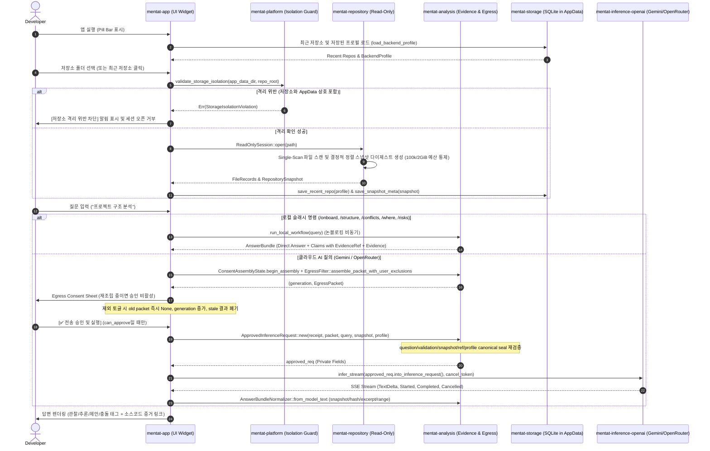

# Code Mentat Implementation Summary (IMPLEMENTATION_SUMMARY.md)
## 코드 멘타트 구현 요약서

- **문서 버전:** 0.2.0-plan (`CR-UX-001`)
- **패키지 버전:** Cargo workspace `0.1.0` (`0.1.0-dev`는 미릴리스 문서 상태)
- **표준 규격:** AI Implementation Documentation Standard Section 6
- **기준 작성일:** 2026-08-18 (최종 수정: 2026-08-19)
- **구현 구분:** 0장은 현재 CR-UX-001 구현 증거, 1~3장은 역사적 v0.1 runtime, 4장은 전환 gap ledger

---

## 0. CR-UX-001 현재 구현 증거

### 기본 실행 경로

```text
MentatChatApp
  → repository 없는 Conversation/ChatMessage
  → PromptProfile active revision + PromptComposer(CM_PROMPT_V1)
  → AgentRequest(messages, tools=0)
  → 활성 provider Markdown stream
  → terminal CAS + AppData SQLite v4
  → 세로 timeline/CommonMark projection
```

- 기본 앱은 `312.5×660`, 최소 `240×360` 세로형이며 사용자 상태 전환에 `ViewportCommand::InnerSize`를 보내지 않는다.
- 설정은 공급자 조회→동적 모델 선택→실제 생성 검증→capability→활성화 순서를 사용한다. 모델 ID preset/fallback은 추가하지 않았다.
- Kernel/System/Persona factory asset은 application resource이며 DB에는 key/version/checksum만 저장한다.
- System/Persona edit, preset, reset, cancel, 과거 version draft restore, expected-active CAS Apply가 연결됐다.
- repository folder는 read-only scan/snapshot으로 연결되며 Incomplete/STALE tool 경계가 유지된다.

### 구현된 보안·Agent 기반

| 경계 | 구현 증거 |
|---|---|
| sealed tool surface | `RepositoryToolName::ALL` 정확히 6개, write/process variant 0 |
| bounded gateway | 호출당 400행/64KiB, turn 256KiB, path/live-hash/STALE/cancel 검사 |
| AgentLoop | 8 rounds, 24 calls, 300초, 동일 fingerprint 3회 차단, local tool→GroundingTrace |
| Audit terminal | raw JSON UI 비노출, `answer_bundle.v1` parse와 Gateway SourceRef exact match |
| canonical egress | `CM_TOOL_EGRESS_V1`, provider/full endpoint/model/snapshot/ref/payload/exact-body digest |
| durable storage | SQLite v1→v4 `BEGIN IMMEDIATE`, online backup, DB/WAL/SHM quarantine, Prepared status CAS |
| privacy delete | conversation cascade로 turn/message/trace/source/receipt/Audit result 삭제 |

### 현재 fail-closed 잔여 경계

- OpenAI/Gemini adapter의 exact serialized provider body와 durable receipt를 한 호출로 결속하는 body-gate는 아직 기본 provider tool loop에 연결되지 않았다.
- 따라서 외부 provider repository tool result는 `TOOL_EGRESS_CONSENT_REQUIRED`로 차단한다. 일반 chat과 local/fake AgentLoop 검증은 동작한다.
- Grounding drawer와 cloud Audit mode projection은 타입/validator/store까지 구현됐으나 기본 Chat UI에 아직 연결되지 않았다.

### 2026-08-19 검증

- `cargo test --workspace --locked`: 147 passed, 2 ignored(100k/2GiB profile, native credential smoke)
- `cargo test -p mentat-platform native_secret_store_round_trip_and_delete --locked -- --ignored`: Windows Credential Manager put/get/delete PASS
- `cargo clippy --workspace --all-targets --locked -- -D warnings`: PASS
- `cargo build -p mentat-app --locked`: PASS
- `cargo build --release -p mentat-app --locked`: PASS
- `cargo audit --no-fetch --file Cargo.lock`: 기존 `quick-xml 0.30.0` High 2건과 unmaintained 2건으로 FAIL; keyring 신규 finding 0
- ignored 100k/2GiB profile: 100,000 files, 2,147,483,648 bytes, 81,793ms, peak working set 48,783,360 bytes(<128MiB) PASS
- 실제 Windows 실행: 313×660(DPI 반올림), 한글 폰트, 닫기/설정/핀/새 대화, 저장소 연결, 3행 composer 확인
- 실제 설정 스크롤: provider 3단계, Kernel read-only, System/Persona editor, Apply/Cancel/Factory Reset 확인
- 600×800 실제 drag는 Windows helper가 창 외부 좌표를 거부해 미실행이며, 저장·재오픈은 SQLite integration test로 검증했다.

### Window/Settings 후속 구현

- 기본 `312.5×660`, 최소 `240×360`; 실제 Windows 캡처는 DPI 반올림 `313×660` 확인
- SQLite v5 `ui_preferences`: width/height/submit mode/pin/layout revision round-trip
- 역사적 기본 `250×600`만 revision 2에서 확대하고 `600×800` custom fixture는 보존
- 저장 model ID는 표시하지만 catalog/생성 검증 전 `Draft`이며 자동 Active 금지
- Prompt source에서 Persona factory/custom 표시를 복원
- `SecretStore`/`NativeSecretStore`: Windows Credential Manager 실제 put/get/delete smoke PASS
- `CredentialController`: API key native round-trip, 저장 해제 delete, SQLite key byte 0 테스트 PASS
- 실제 UI: API key 저장 checkbox, 모델 재검증 상태, pin과 Enter/Ctrl+Enter 종료·재실행 복원 확인
- 실제 창: 최초 313×660 확인. Windows helper가 frameless resize border 바깥 좌표를 허용하지 않아 custom drag 자동화는 미실행이며 `600×800` close/reopen은 SQLite v5 integration fixture로 검증

---

## 1. 전체 런타임 흐름 (Runtime Execution Flow)



---

## 2. 모듈별 구현 현황 (Hexagonal Architecture)

| Crate | 역할 | 주요 구현 내용 | 검증 테스트 |
|---|---|---|---|
| `mentat-core` | 도메인 모델 & 포트 | `Claim`, `EvidenceRef`, `RepositoryProfile`, `RepositorySnapshot`, `MentatError` 정의 | - |
| `mentat-platform` | OS 플랫폼 & 격리 가드 | 폴더 선택기, 클립보드 복사, `validate_storage_isolation` (AppData 상호 침범 방지) | `test_storage_isolation_detection` |
| `mentat-repository` | 읽기 전용 저장소 엔진 | Incomplete snapshot, memory gate, ignore-aware watcher, Any/Other/Rescan과 ignore-control fail-closed | `test_dbg_f002_rescan_unknown_and_ignore_control_events_fail_closed`, `test_dbg_f002_git_info_exclude_change_marks_snapshot_stale` |
| `mentat-storage` | AppData SQLite 영속화 | `SqliteStorage`, 최근 저장소, 프로필, 스냅샷, canonical root 조회 | `test_sqlite_storage_save_and_list_recent_repos`, `test_imp_f005_find_repo_by_canonical_root` |
| `mentat-analysis` | 정적 분석 및 유출 통제 | 모든 cloud claim과 ConflictItem evidence invariant, verified answer projection, canonical seal, live hash lineage | `test_imp_f004_cloud_conflict_items_require_unique_valid_evidence`, `test_imp_f004_claim_invariants_reject_empty_duplicate_and_invalid_confidence` |
| `mentat-inference` | 추론 도메인 인터페이스 | 동적 `ModelCatalog`, `ModelVerification`, 하드코딩 없는 `BackendProfile`, URL 검증, 테스트 더블 | `production_profile_does_not_choose_a_hardcoded_model`, `model_catalog_rejects_empty_ids_and_deduplicates_provider_data` |
| `mentat-inference-openai` | 멀티 프로바이더 스트리밍 | Gemini thinking-aware 전체 candidate/part probe, finish 진단, 동적 모델 검색, redirect/client fail-closed, SSE | `selected_gemini_model_must_pass_a_real_generation_probe`, `gemini_verification_reports_finish_reason_when_visible_text_is_missing`, `gemini_cross_origin_redirect_never_receives_api_key` |
| `mentat-inference-llama` | 미래 온디바이스 계약 | `NativeLlamaContract`, 하드웨어 탐지 스텁 | `test_native_llama_contract_isolated_context_and_kv_cleanup` 등 3개 |
| `mentat-persona` | 페르소나 및 아나운서 | 이모지 글꼴에 의존하지 않는 3가지 페르소나 표시명, 사실 보존 렌더러, 중요도 기반 알림 정책 | `test_persona_rendering_preserves_facts_and_evidence`, `test_announcement_policy_levels` |
| `mentat-app` | eframe 데스크톱 UI | 고대비 스위스 라이트 테마, 고정 trailing/저장소 ellipsis, 명시적 종료 수명주기, Draft/Verified/Active 공급자 상태, incomplete query gate | `long_ascii_repository_name_keeps_trailing_controls_visible_at_640_and_760`, `long_cjk_repository_name_keeps_trailing_controls_visible_at_640_and_760`, `shutdown_cancels_scan_and_stream_tokens` |
| `xtask` | 멀티 플랫폼 빌드 오케스트레이터 | 메뉴/CLI 파싱, Windows/Linux/macOS target matrix, rustup preflight, locked gates/build plan, dry-run | `command_mode_parses_platform_arch_profile_and_switches`, `all_platforms_expand_to_the_documented_target_matrix`, `gated_release_plan_is_locked_and_builds_only_the_app` |

### UI 복구 실행 증거 (2026-08-19)

- 수정 전 원인: 프레임리스 투명 창에 앱 종료 동작이 없었고 dark visual의 암묵적 foreground와 작은 명시 글자 크기가 표시 환경에 따라 가독성을 떨어뜨렸다.
- 수정 후 실제 실행: 초기 Tier 1은 불투명 흰색 `760×56`, 설정은 `760×480`, `/onboard` 대화 카드는 `760×360`으로 확장됐고 한글 레이블·상태·버튼이 검정 중심 고대비로 표시됐다.
- 종료 실행 증거: 릴리스 앱의 `종료 ×` 클릭과 `Ctrl+Q` 입력을 각각 수행한 뒤 `Code Mentat` 창이 0개가 됨을 확인했다.
- 폰트 자산: `crates/mentat-app/assets/fonts/NanumGothic-Regular.ttf`와 OFL 1.1 라이선스를 앱 바이너리에 포함한다.

---

## 3. 품질 게이트 검증 결과 (Verification Results)

- **단위/회귀 테스트:** `cargo test --workspace --locked` 실행 증거 (108 passed, 1 ignored 100k/2GiB profile)
- **100k/2GiB profile:** 100,000 files / 2,147,483,648 bytes / preview 3,358,720 bytes / scan 80,377ms / Windows peak working set 46,231,552 bytes / 128MiB threshold (별도 ignored gate PASS)
- **포맷팅 검사:** `cargo fmt --all -- --check` (0 diffs)
- **정적 분석:** `cargo clippy --workspace --all-targets --all-features --locked -- -D warnings` (0 errors, 0 warnings)
- **릴리스 바이너리 빌드:** `cargo build --release -p mentat-app --locked` (완료)
- **Windows UI 런타임:** `760x56` Tier 1에서 우측 `고정`·`설정`·`종료 ×` 순서와 `760x480` 설정 확장, 종료 후 창 0개를 확인. 640/760px 긴 ASCII/CJK geometry는 headless render tests로 검증
- **빌드 오케스트레이터:** `cargo mentat-build build --platform current --profile release --gates`가 fmt→Clippy→107 tests→locked release를 순서대로 통과하고 `target/release/mentat-app.exe`를 생성. PowerShell wrapper 실제 debug build, 메뉴 종료, POSIX shell syntax와 6-target dry-run을 확인
- **CI matrix 연결:** Windows/Linux/macOS runner의 release 단계가 `cargo mentat-build build --platform current`를 사용하고 각 runner에서 6-target dry-run 계약을 함께 검사
- **Windows global shortcut runtime:** 다른 앱 포커스에서 `Ctrl+Alt+M` 전역 event 수신과 Code Mentat 표시 유지/Tier 1 non-hide fallback 확인
- **Baseline 원문 대조:** `CODE_MENTAT_SPEC.md`와 `spec.md`의 FR/NFR/CON 47개 정의·수용 기준, mismatch 0
- **의존성 보안 감사:** `cargo audit --no-fetch --file Cargo.lock` FAIL — `quick-xml 0.30.0` High 2건(`RUSTSEC-2026-0194`, `RUSTSEC-2026-0195`)과 unmaintained 2건. High 2건은 `DEC-SEC-004`의 Windows 비도달 Accepted Risk이며 audit 실패를 PASS로 표기하지 않음

---

## 4. CR-UX-001 전환 구현 Ledger

### 4.1 현재 코드와 목표 차이

| 영역 | 현재 v0.1 | 목표 | 단계 |
|---|---|---|---|
| 최상위 상태 | 단일 query/answer/claims | Conversation + ordered ChatMessage | CR-1/2 |
| Prompt | AnswerBundle system contract + Persona 후처리 | immutable Kernel + editable System/Persona pre-compose | CR-1/2 |
| 추론 | 단발 InferenceRequest/Event | multi-message AgentRequest/Event + capability | CR-2/3 |
| 저장소 조사 | static top-8/first-60 context | six bounded read-only tools + AgentLoop | CR-3 |
| Egress | static packet/boolean repo consent | turn/session scope + batch receipt + trace | CR-4 |
| UI | 3-Tier forced resize Pill | 312.5×660 vertical resizable chat | CR-5 |
| Evidence | Claim cards/whole inspector | per-message Grounding drawer | CR-6 |
| Audit | default projection | explicit transient Audit Mode | CR-6 |
| Model gate | compatible bool | chat/native/emulated/advisor capability matrix | CR-7 |
| Persistence | recent repo/provider/snapshot | prompt/conversation/trace/preferences migrations | CR-1/3/4/7 |

### 4.2 단계 상태

| 단계 | 상태 | 구현 파일 | 필수 증거 |
|---|---|---|---|
| CR-0 | Review Ready | 문서 세트만 변경 | 문서 ID/계약/trace 정합성, 사용자 GO |
| CR-1 | Not Started | core/persona/storage | prompt checksum, migration/reopen/recovery |
| CR-2 | Not Started | inference/analysis/provider/storage | no-repo chat, Markdown preservation, cancel |
| CR-3 | Not Started | analysis/repository/inference/providers | six tools, loop/budget/cancel, no-write API |
| CR-4 | Not Started | consent/egress/evidence/storage | zero-before-consent, canonical tamper, stale |
| CR-5 | Not Started | app/widgets/storage | breakpoints, resize restore, prompt settings |
| CR-6 | Not Started | app/answer bundle/grounding | Advisor/Audit isolation, source jump |
| CR-7 | Not Started | providers/storage/app/CI | capability parity, legacy migration, compaction |
| CR-8 | Not Started | audit reports | 3-pass + independent final re-audit |

### 4.3 계획 파일 책임

| 파일/영역 | 계획 책임 |
|---|---|
| `mentat-core` models/ports | neutral conversation, prompt, trace IDs/types and stores |
| `mentat-persona` assets/composer | 4 System/3 Persona factory prompts, checksum, deterministic compose |
| `mentat-inference` | AgentRequest/Message/Event/Capabilities semantic contract |
| `mentat-analysis/conversation_orchestrator.rs` | chat/tool round orchestration across core/inference/repository |
| `mentat-analysis/repository_tools.rs` | six sealed tools, argument/budget/SourceRef handling |
| `mentat-analysis/tool_egress.rs` | consent authorization hook, dynamic receipt, trace |
| provider adapters | native/emulated wire mapping only |
| `mentat-storage` | versioned migrations and AppData persistence/recovery |
| `mentat-app` widgets | vertical chat, prompt/model/privacy settings, grounding/Audit projections |

### 4.4 현재 승인 상태

```text
CR implementation files changed: 0
CR requirements implemented: 0/43
Documentation gate: REVIEW READY
Implementation authorization: PENDING USER CR-UX-001 GO
```

### 4.5 구현 착수 시 우선 제거할 현행 위험

| 현행 위험 | 현재 위치 | 계획 처리 |
|---|---|---|
| storage open/load 오류가 `.ok()`/default로 숨겨짐 | `mentat-app/src/app.rs` startup | CR-1/7에서 explicit ephemeral/failure state |
| malformed UUID/date/status가 임의 값/Ready로 복구 | `mentat-storage/src/db.rs` | versioned decoder fail-closed |
| `INSERT OR REPLACE`가 향후 FK cascade와 충돌 | storage save methods | `ON CONFLICT DO UPDATE`로 migration 전환 |
| `repo_consent_given: bool`이 profile/model 변경 뒤 남을 수 있음 | app consent flow | typed turn/session scope와 revoke로 교체 |
| EgressReceipt에 conversation/turn/tool/source 결속 없음 | `mentat-analysis/src/egress.rs` | CR-4 durable ToolEgressReceipt |
| Evidence content_hash가 file body hash가 아님 | `mentat-analysis/src/evidence.rs` | SourceRef actual file SHA와 identity digest 분리 |
| search read 오류가 결과 없음처럼 누락 | `mentat-analysis/src/search.rs` | explicit ToolOmission/Incomplete |
| watcher channel disconnect가 no-change로 처리 | `mentat-repository/src/watcher.rs` | STALE fail-closed |
| ModelVerification이 compatible bool 하나 | inference/setup state | CR-7 4-capability matrix |
| eframe persistence feature 없음 | workspace/app startup | AppData `ui_preferences` 단일 source로 구현 |
