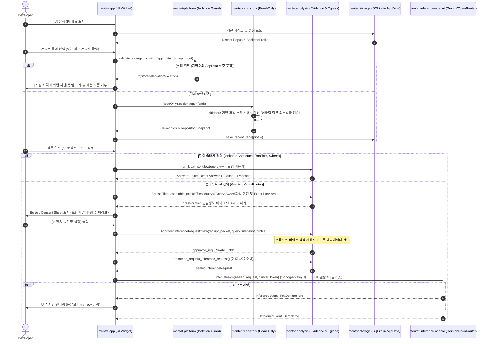

# Code Mentat Implementation Summary (IMPLEMENTATION_SUMMARY.md)
## 코드 멘타트 구현 요약서

- **문서 버전:** 0.1.0-dev (Turn 7 / Re-audit #4 Remediation)
- **표준 규격:** AI Implementation Documentation Standard Section 6
- **기준 작성일:** 2026-08-18 (최종 수정: 2026-08-19)

---

## 1. 전체 런타임 흐름 (Runtime Execution Flow)



---

## 2. 크레이트별 파일 책임표 (System Decomposition & Responsibilities)

| Crate | 핵심 소스 파일 | 담당 책임 및 핵심 함수 |
|---|---|---|
| **`mentat-core`** | `src/models.rs` | `Claim`, `EvidenceRef`, `ConflictItem`, `RepositorySnapshot`, `AnswerBundle` 엔티티 정의 |
| | `src/ports.rs` | `RepositoryReader`, `StoragePort` 핵심 인터페이스 포트 정의 |
| | `src/error.rs` | `MentatError` (`StorageIsolationViolation`, `EgressViolation`, `InferenceError`, `BackendError` 등) |
| **`mentat-repository`** | `src/session.rs` | `ReadOnlySession`: 파일 읽기 전용 스캔, 10MB 상한 바운드, 상위 경로 탈출 차단 |
| | `src/scanner.rs` | `FileScanner`: `.gitignore` 규칙 준수, 심볼릭 링크 루트 탈출 가드(`SEC-F006`), 64KB 스트리밍 해시 버퍼 |
| | `src/watcher.rs` | `RepositoryWatcher`: mtime 기반 파일 변경 감지 및 `STALE` 전이 |
| **`mentat-analysis`** | `src/detector.rs` | `ProjectDetector`: 언어 분포, 매니페스트, 진입점, 테스트 파일 탐지 |
| | `src/evidence.rs` | `EvidenceIndex`: 경로+행범위+내용 SHA-256 해시 기반 행 단위 발췌문 인덱싱 |
| | `src/semantic_kernel.rs` | `SemanticKernelBuilder`: `/onboard`, `/structure`, `/conflicts`, `/where` 로컬 분석 |
| | `src/egress.rs` | `EgressFilter` & `ApprovedInferenceRequest`: 고엔트로피 키/JWT/AWS 키 스캔, escape-aware JSON 파서, query-aware 랭킹, exact preview, consume-once (`into_inference_request`) |
| **`mentat-inference`** | `src/lib.rs` | `InferenceBackend` trait (`health_check`, `infer_stream`, `estimate_tokens`) |
| | `src/types.rs` | `BackendProfile`: API 키 Redacted Safe Debug, URL TLS/Loopback 검증(`validate_url`) |
| | `src/fake.rs` | `FakeInferenceBackend`: 비동기 스트리밍, 취소 토큰, 타임아웃 테스트 더블 |
| **`mentat-inference-openai`** | `src/gemini_adapter.rs` | Google Gemini `x-goog-api-key` 헤더 전송, URL 보안 검증, 타임아웃, SSE 스트리밍 |
| | `src/openai_adapter.rs` | OpenRouter 및 OpenAI `/v1/chat/completions` SSE 스트리밍 클라이언트 |
| | `src/lib.rs` | `MultiProviderAdapter`: 공급자별 동적 라우팅 및 헬스체크 |
| **`mentat-inference-llama`** | `src/contract.rs` | `NativeLlamaContract`: `ModelDescriptor`, `IsolatedContextHandle`, `ConcurrencyGate` |
| **`mentat-persona`** | `src/persona.rs` | `PersonaRenderer`: 기본 분석가, 메스카키 아나운서, 간결한 감사자 렌더러 |
| | `src/announcer.rs` | `AnnouncementPolicy`: 중요도 0~5단계 아나운서 제어 |
| **`mentat-storage`** | `src/db.rs` | `SqliteStorage`: AppData 경로 `mentat.db` 마이그레이션 및 최근 저장소 CRUD |
| **`mentat-platform`** | `src/lib.rs` | `PlatformManager`: fail-closed AppData 경로 획득, 엄격한 상호 격리 검증(`validate_storage_isolation`) |
| **`mentat-app`** | `src/app.rs` | `MentatApp`: 논블로킹 UI 채널 폴링(`try_recv`), Tier별 Viewport Resize, Fail-Closed Egress Consent Sheet, UI 렌더링 |
| | `src/theme.rs` | `MentatTheme`: 다크 테마 색상 토큰 및 비주얼 스타일 |
| | `src/widgets/pill_bar.rs` | `PillBar`: Tier 1 컴팩트 알약 바 위젯 렌더링 및 동적 R/O 뱃지 |
| | `src/widgets/settings_panel.rs` | `SettingsPanel`: 공급자/모델 선택, API 키 마스킹, 페르소나 전환, Ping 시험 |

---

## 3. 결정적 검증 증거 (Deterministic Verification Evidence)

```bash
# 1. 포맷 검사
$ cargo fmt --all -- --check (PASS - 0 diffs)

# 2. Strict Clippy 린트 검사
$ cargo clippy --workspace --all-targets --all-features --locked -- -D warnings (PASS - 0 errors, 0 warnings)

# 3. Workspace 단위 및 회귀 테스트
$ cargo test --workspace --locked (PASS - 26 passed, 0 failed, 0 ignored)
  - mentat_analysis (12 passed):
    * test_escaped_quote_json_assignment_redaction: ok (SEC-F002 이스케이프 파싱)
    * test_complete_pem_block_redaction_zero_raw_leak: ok
    * test_aws_key_and_jwt_redaction: ok (SEC-F002 고엔트로피/JWT/AWS 토큰 마스킹)
    * test_approved_inference_request_binding_integrity_and_consume_once: ok
    * test_github_pat_and_classic_token_redaction: ok
    * test_json_yaml_assigned_secrets_redaction: ok
    * test_sec_f010_unicode_casing_expansion_exact_byte_offsets: ok
    * test_sensitive_filtering_comprehensive: ok
    * test_unicode_adjacent_secrets_zero_panic_and_safe_redaction: ok
    * test_detector_rust_project: ok
    * test_evidence_and_prompt_injection_safety: ok
    * test_multiple_secrets_on_single_line: ok
  - mentat_app (2 passed):
    * test_app_expansion_tier_transitions: ok
    * test_tampered_egress_request_rejection_fail_closed: ok
  - mentat_inference (2 passed): ok
  - mentat_inference_llama (3 passed): ok
  - mentat_inference_openai (1 passed): ok
  - mentat_persona (2 passed): ok
  - mentat_platform (1 passed): ok
  - mentat_repository (2 passed): ok
  - mentat_storage (1 passed): ok

# 4. Locked Release Build 검사
$ cargo build --release --locked -p mentat-app (PASS - Finished in 8.61s)

# 5. Git Repository & Multi-Platform CI
- Git Repository Root: C:/LocalDev/rust/CodeMentat (DBG-F006 해소)
- GitHub Remote: git@github.com:Yupkidangju/CodeMentat.git
- CI Workflow: .github/workflows/ci.yml (Windows, Linux, macOS)
```
