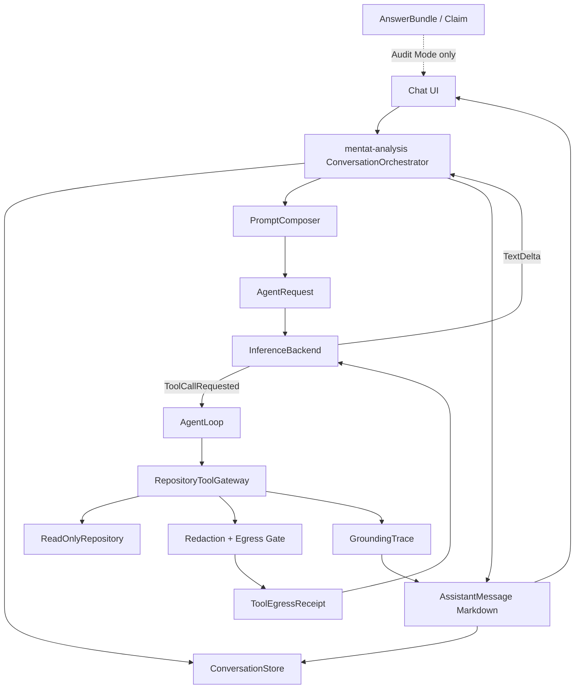
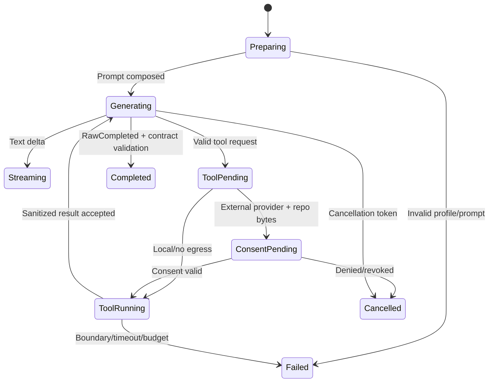

# CR-UX-001 목표 시스템 아키텍처

- **상태:** `APPROVED — PRODUCTION PARTIAL / RE-AUDIT PENDING`
- **기준:** `Code Mentat 자유 대화형 저장소 멘토 전환 변경요청서.md`
- **현재 구현:** 단발 `InferenceRequest` + AnswerBundle 중심
- **목표 구현:** ConversationOrchestrator + PromptComposer + bounded AgentLoop + 자유 Markdown/GroundingTrace 분리
- **Prompt 원문 계약:** `PROMPT_CONTRACT.md`

## 1. 런타임 흐름



일반 대화에는 `RepositoryToolGateway`와 repository consent가 개입하지 않는다. 저장소가 열려 있어도 모델이 도구를 요청하지 않으면 tool call은 0건이다.

## 2. 핵심 타입 계약

아래는 구현 시 의미를 보존해야 하는 설계 계약이다. 중립 conversation/prompt/trace/evidence/tool-invocation 타입과 store ports는 `mentat-core`, AgentRequest/Event/ToolDefinition은 `mentat-inference`, orchestration과 gateway 구현은 `mentat-analysis/src/conversation_orchestrator.rs`에 둔다.

```rust
struct Conversation {
    id: Uuid,
    repository_id: Option<Uuid>,
    active_snapshot_id: Option<Uuid>,
    prompt_profile_id: Uuid,
    messages: Vec<ChatMessage>,
    compact_summary: Option<String>,
    created_at: DateTime<Utc>,
    updated_at: DateTime<Utc>,
}

enum ChatRole { User, Assistant }

enum MessageStatus {
    Pending,
    Streaming,
    Completed,
    Cancelled,
    Failed { error_code: String },
}

struct ChatMessage {
    id: Uuid,
    conversation_id: Uuid,
    turn_id: Uuid,
    role: ChatRole,
    markdown: String,
    status: MessageStatus,
    source_refs: Vec<SourceRef>,
    grounding_trace_id: Option<Uuid>,
    grounding_freshness: Option<GroundingFreshness>,
    created_at: DateTime<Utc>,
}

struct ConversationTurn {
    id: Uuid,
    conversation_id: Uuid,
    sequence: u64,
    prompt_profile_id: Uuid,
    prompt_profile_revision_id: Uuid,
    kernel_version: String,
    kernel_digest: String,
    snapshot_id: Option<Uuid>,
    response_contract: ResponseContract,
    audit_result_id: Option<Uuid>,
    started_at: DateTime<Utc>,
    completed_at: Option<DateTime<Utc>>,
}

enum ResponseContract {
    AdvisorMarkdown,
    AuditAnswerBundle { schema_version: String },
}

enum SystemPreset { Beginner, Intermediate, Professional, Senior }
enum ExperiencePreset { Beginner, Intermediate, Professional, Senior, Custom }

enum ComposerSubmitMode { EnterSend, CtrlEnterSend }

struct PromptProfile {
    id: Uuid,
    name: String,
    experience_preset: ExperiencePreset,
    base_system_preset: SystemPreset,
    active_revision_id: Uuid,
    factory_system_version: String,
    factory_persona_version: String,
    created_at: DateTime<Utc>,
    updated_at: DateTime<Utc>,
}

enum PromptLayer { System, Persona }
enum PromptContentSource {
    FactoryRef { resource_key: String, resource_version: String, checksum: String },
    UserText { content: String, checksum: String },
    RestoredText { content: String, checksum: String, restored_from: Uuid },
}

struct PromptContentVersion {
    id: Uuid,
    profile_id: Uuid,
    layer: PromptLayer,
    version: u64,
    source: PromptContentSource,
    parent_version_id: Option<Uuid>,
    created_at: DateTime<Utc>,
}

struct PromptProfileRevision {
    id: Uuid,
    profile_id: Uuid,
    revision: u64,
    system_version_id: Option<Uuid>,
    persona_version_id: Option<Uuid>,
    system_checksum: String,
    persona_checksum: String,
    content_deleted: bool,
    expected_previous_revision_id: Option<Uuid>,
    created_at: DateTime<Utc>,
}

struct UiPreferences {
    width_points: f32,
    height_points: f32,
    submit_mode: ComposerSubmitMode,
    updated_at: DateTime<Utc>,
}

enum ConversationPersistence { Durable, Ephemeral }

struct NewConversation {
    repository_id: Option<Uuid>,
    active_snapshot_id: Option<Uuid>,
    prompt_profile_id: Uuid,
    persistence: ConversationPersistence,
}

struct TurnStart {
    turn: ConversationTurn,
    user_message: ChatMessage,
    assistant_placeholder: ChatMessage,
}

enum TurnTerminalUpdate {
    AdvisorCompleted {
        turn_id: Uuid,
        assistant_message_id: Uuid,
        markdown: String,
        grounding_trace_id: Option<Uuid>,
        freshness: Option<GroundingFreshness>,
        completed_at: DateTime<Utc>,
    },
    AuditCompleted {
        turn_id: Uuid,
        assistant_message_id: Uuid,
        result: AnswerBundle,
        grounding_trace_id: Uuid,
        freshness: GroundingFreshness,
        completed_at: DateTime<Utc>,
    },
    AdvisorCancelled {
        turn_id: Uuid,
        assistant_message_id: Uuid,
        partial_markdown: String,
        completed_at: DateTime<Utc>,
    },
    AuditCancelled {
        turn_id: Uuid,
        assistant_message_id: Uuid,
        completed_at: DateTime<Utc>,
    },
    Failed {
        turn_id: Uuid,
        assistant_message_id: Uuid,
        error_code: String,
        safe_message: String,
        completed_at: DateTime<Utc>,
    },
}

enum PromptLayerDraft {
    Preserve,
    UserText(String),
    ResetToFactory { resource_key: String, resource_version: String, expected_checksum: String },
    RestoreVersion { content_version_id: Uuid },
}

struct PromptDraft {
    profile_id: Uuid,
    name: String,
    experience_preset: ExperiencePreset,
    base_system_preset: SystemPreset,
    system: PromptLayerDraft,
    persona: PromptLayerDraft,
}

struct ResolvedPromptProfile {
    profile: PromptProfile,
    revision: PromptProfileRevision,
    system_text: String,
    persona_text: String,
}

struct StoredPromptProfile {
    profile: PromptProfile,
    revision: PromptProfileRevision,
    system_source: PromptContentSource,
    persona_source: PromptContentSource,
}

struct DeleteReceipt {
    operation_id: Uuid,
    deleted_counts: BTreeMap<String, u64>,
    removed_artifacts: Vec<String>,
    completed_at: DateTime<Utc>,
}
```

### 2.1 저장 포트

```rust
trait ConversationStore {
    async fn create_conversation(&self, draft: NewConversation) -> Result<Conversation, MentatError>;
    async fn load_conversation(&self, id: Uuid) -> Result<Option<Conversation>, MentatError>;
    async fn begin_turn(&self, start: TurnStart) -> Result<(), MentatError>;
    async fn append_assistant_delta(&self, message_id: Uuid, delta: &str) -> Result<(), MentatError>;
    async fn finish_turn(&self, terminal: TurnTerminalUpdate) -> Result<(), MentatError>;
    async fn delete_conversation(&self, id: Uuid) -> Result<DeleteReceipt, MentatError>;
}

trait PromptProfileStore {
    async fn load_active(&self, id: Uuid) -> Result<StoredPromptProfile, MentatError>;
    async fn apply(&self, expected_revision: Uuid, draft: PromptDraft) -> Result<PromptProfileRevision, MentatError>;
    async fn list_versions(&self, profile_id: Uuid, layer: PromptLayer) -> Result<Vec<PromptContentVersion>, MentatError>;
    async fn wipe_custom_content(&self, profile_id: Uuid) -> Result<DeleteReceipt, MentatError>;
}

trait GroundingStore {
    async fn prepare_trace(&self, trace: GroundingTrace) -> Result<(), MentatError>;
    async fn append_tool_record(&self, record: RepositoryToolCallRecord) -> Result<(), MentatError>;
    async fn set_freshness(&self, trace_id: Uuid, freshness: GroundingFreshness) -> Result<(), MentatError>;
}

trait ToolEgressStore {
    async fn prepare_receipt(&self, receipt: ToolEgressReceipt) -> Result<(), MentatError>;
    async fn compare_and_set_status(&self, id: Uuid, expected: ToolEgressStatus, next: ToolEgressStatus) -> Result<(), MentatError>;
}
```

`begin_turn`, prompt Apply, delete, Prepared receipt는 각각 독립 transaction이다. repository-backed turn의 terminal update는 최종 GroundingTrace/tool/source와 같은 `finish_turn_with_grounding` transaction에서만 확정한다. 같은 provider body의 receipt terminal은 ID별 호출이 아니라 batch CAS transaction을 사용한다. streaming delta write는 250ms 또는 4KiB 중 먼저 도달한 조건으로 batch하고 terminal 시 즉시 flush한다.

AppData DB sibling lock file의 OS exclusive handle을 DB open/migration보다 먼저 획득하고 storage clone 전체 수명 동안 공유한다. kernel lock을 얻은 startup만 schema v6 owner metadata를 교체하고 Prepared receipt와 orphan Pending/Streaming turn을 복구한다. lock contention은 DB를 열지 않고 session-only UI로 fail-closed하며, transient SQLite busy/locked/permission/recovery 오류는 quarantine으로 라우팅하지 않는다.

### 2.2 Prompt 합성

```rust
struct PromptComposition {
    kernel_contract: String,        // 읽기 전용, 비영속 사용자 수정 금지
    editable_system_prompt: String,
    editable_persona_prompt: String,
    repository_notice: String,      // repo/snapshot/tool availability only
    digest: String,                 // 비밀 제외 canonical digest
}
```

합성 순서는 고정이며 API 키, secret reference, 절대 저장소 경로, 대화 원문 로그는 포함하지 않는다. factory resource는 버전 문자열과 SHA-256을 갖는다.

`PromptContentSource::FactoryRef`는 DB에 원문을 저장하지 않는다. storage는 `StoredPromptProfile`까지만 반환하고, `mentat-persona`의 신뢰된 factory resolver가 versioned application resource를 `resource_key`로 읽어 checksum을 확인한 뒤 `ResolvedPromptProfile`을 만든다. User/Restored source만 AppData에 text를 저장한다. 이 2단계 경계 때문에 `mentat-storage`는 `mentat-persona`에 의존하지 않는다.

### 2.3 Agent 계약

```rust
struct AgentCapabilities {
    chat_capable: bool,
    native_tool_capable: bool,
    emulated_tool_capable: bool,
    repository_advisor_capable: bool,
}

struct AgentLimits {
    max_rounds: u8,             // 8
    max_tool_calls: u16,        // 24
    max_tool_result_bytes: u32, // 262_144
    timeout: Duration,          // <= 300s
}

struct AgentRequest {
    request_id: Uuid,
    conversation_id: Uuid,
    turn_id: Uuid,
    profile: BackendProfile,
    prompt: PromptComposition,
    messages: Vec<AgentMessage>,
    tools: Vec<ToolDefinition>,
    repository_context: Option<RepositoryContext>,
    response_contract: ResponseContract,
    limits: AgentLimits,
}

enum AgentRole { System, User, Assistant, Tool }

struct AgentMessage {
    role: AgentRole,
    content: AgentMessageContent,
}

enum AgentMessageContent {
    Text(String),
    ToolCalls(Vec<RepositoryToolCall>),
    ToolResult(RepositoryToolResult),
}

enum InferenceRoundEvent {
    Started { request_id: Uuid },
    ThinkingDelta(String),
    TextDelta(String),
    ToolCallsRequested { round: u8, calls: Vec<RepositoryToolCall> },
    UsageUpdate { prompt_tokens: usize, completion_tokens: usize },
    RawCompleted { full_text: String },
    Failed { error_code: String, safe_message: String },
}

enum CompletedPayload {
    AdvisorMarkdown(String),
    ValidatedAuditBundle(AnswerBundle),
}

enum CancelledPayload {
    AdvisorPartialMarkdown(String),
    AuditNoContent,
}

enum AgentEvent {
    Started { request_id: Uuid },
    ThinkingDelta(String),
    TextDelta(String),
    ToolProgress { round: u8, completed_calls: u16, total_calls: u16 },
    UsageUpdate { prompt_tokens: usize, completion_tokens: usize },
    Completed { payload: CompletedPayload, trace_id: Option<Uuid> },
    Cancelled { payload: CancelledPayload },
    Failed { error_code: String, safe_message: String },
}
```

Provider round 내부의 tool-role message/result는 transient `AgentMessage`에만 존재한다. persisted `ChatMessage`에 tool result 원문을 저장하지 않으며 진행 표시는 AgentLoop state와 최종 `GroundingTrace` metadata에서 투영한다. Audit 취소는 반드시 `CancelledPayload::AuditNoContent`이며 내부 JSON buffer 또는 그 일부를 `ChatMessage.markdown`과 UI에 전달하지 않는다.

한 provider round는 `ToolCallsRequested`, `RawCompleted`, `Failed` 중 하나로 끝난다. `ConversationOrchestrator`는 tool results를 `AgentMessageContent::ToolResult`로 추가해 다음 `infer_round_stream`을 호출한다. provider adapter가 repository gateway를 직접 실행하지 않는다. `RawCompleted`는 `ResponseContract`별 validator가 `CompletedPayload`로 변환한다. `Completed`, `Cancelled`, `Failed`는 상호 배타적 turn terminal event며 이후 delta/tool event는 폐기한다.

```rust
trait InferenceBackend {
    async fn verify_capabilities(&self, profile: &BackendProfile) -> Result<AgentCapabilities, MentatError>;
    async fn infer_round_stream(
        &self,
        request: AgentRequest,
        cancel: CancellationToken,
    ) -> Result<BoxStream<'static, InferenceRoundEvent>, MentatError>;
}
```

## 3. Repository Tool Gateway

```rust
enum RepositoryToolName {
    RepoStatus,
    ListTree,
    SearchPaths,
    SearchText,
    ReadFileLines,
    FileMetadata,
}

struct RepositoryToolCall {
    call_id: Uuid,
    snapshot_id: Uuid,
    name: RepositoryToolName,
    arguments: RepositoryToolArguments,
}

enum RepositoryToolArguments {
    RepoStatus,
    ListTree { relative_path: Option<PathBuf>, depth: u8, limit: u16 },
    SearchPaths { query: String, limit: u16 },
    SearchText { query: String, path_filter: Option<String>, limit: u16 },
    ReadFileLines { relative_path: PathBuf, start_line: usize, end_line: usize },
    FileMetadata { relative_path: PathBuf },
}

struct ToolDefinition {
    name: RepositoryToolName,
    schema_version: String,
    description: String,
    input_schema: serde_json::Value,
}

enum RepositoryToolAvailability {
    Ready,
    MetadataOnlyStale,
    Unavailable,
}

struct RepositoryContext {
    repository_id: Uuid,
    snapshot_id: Uuid,
    snapshot_status: SnapshotStatus,
    availability: RepositoryToolAvailability,
    display_name: String,
}

struct RepositoryToolResult {
    call_id: Uuid,
    snapshot_id: Uuid,
    content: String,
    source_refs: Vec<SourceRef>,
    omissions: Vec<ToolOmission>,
    content_bytes: u32,
}

enum ToolOmissionReason {
    EntryLimit,
    ByteLimit,
    Binary,
    Ignored,
    PermissionDenied,
    ReadError,
    StaleSnapshot,
    LiveHashMismatch,
    Cancelled,
}

struct ToolOmission {
    reason: ToolOmissionReason,
    relative_path: Option<PathBuf>,
    detail_code: String,
    omitted_count: u64,
    omitted_bytes: u64,
}

enum RepositoryToolCallStatus { Pending, Completed, Omitted, Failed }

struct RepositoryToolCallRecord {
    trace_id: Uuid,
    call_id: Uuid,
    round: u8,
    name: RepositoryToolName,
    canonical_arguments_digest: String,
    result_digest: Option<String>,
    content_bytes: u32,
    source_ref_ids: Vec<Uuid>,
    status: RepositoryToolCallStatus,
}

struct SourceRef {
    id: Uuid,
    snapshot_id: Uuid,
    relative_path: PathBuf,
    line_start: usize,
    line_end: usize,
    content_hash: String,
    excerpt: String,
}
```

`content_hash`는 현재 snapshot에 기록된 실제 file body SHA-256이며 path/range/excerpt identity hash와 redacted payload digest는 별도 타입/필드로 유지한다.

### 3.1 도구별 계약

| 도구 | 입력 | 결과 | 기본 상한 |
|---|---|---|---|
| `repo_status` | 없음 | repo/snapshot/status/count, 원문 없음 | 1 result |
| `list_tree` | relative path, depth, limit | 정렬된 상대 경로 | depth 4, 500 entries |
| `search_paths` | query, limit | 정렬된 상대 경로 | 100 matches |
| `search_text` | query, path filter, limit | path/line/snippet SourceRef | 100 matches, 64KiB |
| `read_file_lines` | path, start, end | bounded text + SourceRef | 400 lines, 64KiB |
| `file_metadata` | path | kind/size/hash/line count/status | 1 result |

모든 path는 상대 경로만 수용하며 canonical root, symlink/reparse, binary, stale/live hash, cancellation을 공통 gateway에서 검사한다. write/delete/rename/patch/process/build/test capability는 enum과 port에 존재하지 않는다.

## 4. AgentLoop 상태 머신

provider adapter가 tool result를 포함한 최종 wire body를 직렬화하면 `ProviderBodyEgressGate::authorize_exact_body(request, endpoint, bytes)`를 socket write 직전에 호출한다. `mentat-app`의 durable 구현만 runtime consent capability와 SQLite receipt를 소유하며 inference/provider crate는 repository나 storage를 직접 참조하지 않는다. 승인 성공 뒤에도 adapter는 같은 byte slice를 `.body(...)`로 전송하고, redirect를 자동 추적하지 않는다.



동일 `(tool_name, canonical_arguments, snapshot_id)`가 3회 반복되면 `AGENT_LOOP_REPEATED_CALL`로 중단한다. schema 복구 요청은 전체 턴에서 1회만 허용한다.

## 5. Native/Emulated provider mapping

| 내부 의미 | Native tool provider | Emulated planner provider |
|---|---|---|
| tool definitions | provider function schema | 숨겨진 strict ToolAction schema |
| call request | provider tool call event | planner JSON parsed internally |
| result | provider tool result message | hidden planner follow-up message |
| round final | raw assistant text | planner final phase raw text |
| UI visibility | tool progress + final answer | tool progress + final answer; planner JSON 숨김 |

모델 ID로 능력을 하드코딩하지 않는다. 활성 프로필의 실제 chat probe, native tool probe, emulated planner probe로 capability를 결정한다.

`AdvisorMarkdown`은 raw final text를 byte-preserving Markdown으로 검증한다. `AuditAnswerBundle { schema_version: "answer_bundle.v1" }`은 기존 `AnswerBundleNormalizer::system_contract(snapshot_id)`와 JSON schema를 system contract에 정확히 1회 포함하고 raw final text를 기존 validator로 정규화한다. Tool Gateway가 발급한 SourceRef ID catalog만 Audit evidence로 참조할 수 있다. parse/validation 실패는 `Failed { error_code: "AUDIT_RESPONSE_INVALID" }`이며 `audit_turn_results` 저장과 Advisor Markdown fallback을 모두 금지한다. Advisor request에는 Audit schema/system contract bytes가 0개다.

Advisor round의 `InferenceRoundEvent::TextDelta`만 사용자 `AgentEvent::TextDelta`로 투영한다. Audit round의 raw JSON delta는 내부 buffer/progress로만 처리하고 대화 timeline에 Markdown처럼 표시하지 않는다.

## 6. GroundingTrace와 답변 분리

```rust
struct GroundingTrace {
    id: Uuid,
    conversation_id: Uuid,
    turn_id: Uuid,
    snapshot_id: Option<Uuid>,
    tool_calls: Vec<RepositoryToolCallRecord>,
    source_refs: Vec<SourceRef>,
    egress_receipts: Vec<ToolEgressReceipt>,
    freshness: GroundingFreshness,
}

enum GroundingFreshness {
    FreshAtSend,
    ChangedAfterSend { detected_at: DateTime<Utc> },
    StaleBeforeSend,
}
```

Assistant Markdown은 모델의 정상 최종 텍스트다. SourceRef 검증 실패는 해당 source를 제거하거나 경고하지만 Markdown을 Claim 목록으로 재합성하지 않는다. 저장소 고유 사실을 말하면서 유효 source가 0개면 메시지에 `UngroundedRepositoryAnswer` 상태를 표시한다.

## 7. 저장 모델과 마이그레이션

### 7.1 신규 테이블

| 테이블 | 핵심 키 | 보존/삭제 규칙 |
|---|---|---|
| `conversations` | id, repo_id?, prompt_profile_id, compact_summary | 현재 대화 삭제 시 cascade |
| `conversation_turns` | id, conversation_id, sequence, prompt revision/kernel/snapshot | conversation cascade |
| `chat_messages` | id, conversation_id, turn_id, role, ordinal, markdown, status | turn/conversation cascade |
| `prompt_profiles` | id, preset/base preset, active revision, factory versions | 사용자 명시 삭제 전 유지 |
| `prompt_content_versions` | profile/layer/version/source/checksum | factory는 resource ref only; user text는 AppData, layer별 retention |
| `prompt_profile_revisions` | profile/revision/system version/persona version | Apply의 atomic bundle, turn reference |
| `grounding_traces` | id, conversation_id, turn_id, snapshot_id? | conversation cascade |
| `tool_call_records` | trace_id, call/round/tool/args digest/status | trace cascade |
| `tool_omissions` | tool_call_id, reason/count/bytes | tool call cascade |
| `source_refs` | trace_id + ordinal | trace cascade |
| `repository_consent_scopes` | consent audit metadata, provider target digest, active capability 없음 | conversation cascade |
| `tool_egress_receipts` | receipt_id, trace_id, canonical digest fields | trace cascade; 비밀 원문 없음 |
| `audit_turn_results` | turn_id, schema version, validated AnswerBundle | conversation cascade |
| `ui_preferences` | singleton, width, height, input behavior | AppData only |

각 migration version은 하나의 `BEGIN IMMEDIATE` transaction으로 실행한다. 전체 chain 전 SQLite online backup/checkpoint로 `<db>.pre-cr-ux-001-<UTC>.sqlite`를 만들며, 실패 시 `<db>.quarantine-<UTC>/`에 DB/WAL/SHM을 함께 보존하고 새 DB는 factory prompt로 시작한다. 자동 destructive reset은 금지한다.

마이그레이션 버전 순서는 `v1 legacy registration → v2 conversation/prompt/preferences → v3 grounding/tool records → v4 consent/receipt → v5 window/secret preferences → v6 runtime ownership/receipt owner`로 고정한다. 각 버전은 `BEGIN IMMEDIATE` 안에서 schema와 version을 함께 갱신한다. 미래 unknown version은 downgrade하지 않고 쓰기를 거부한다.

`INSERT OR REPLACE`는 FK cascade 부작용 때문에 신규/변경 테이블에서 사용하지 않고 `INSERT ... ON CONFLICT DO UPDATE`를 사용한다. UUID/date/enum decode 실패와 unknown snapshot status는 새 UUID/현재 시각/Ready로 바꾸지 않고 명시적 storage error로 반환한다.

기존 DB에는 PersonaKind row가 없으므로 legacy persona 변환을 주장하지 않는다. 첫 prompt profile을 `Intermediate + DefaultAnalyst` factory 조합으로 seed한다.

UI size는 egui logical points로 저장한다. resize 정지 500ms와 orderly close에 저장하고 최초 restore frame은 저장 이벤트를 발생시키지 않는다. NaN/무한/0/음수는 무효이며 최소 240×360과 현재 monitor work area로 clamp한다.

일반 history pruning은 System/Persona layer별 최신 5개 unreferenced content version을 최소 보존한다. active profile revision과 기존 conversation turn이 참조하는 bundle/content version은 5개를 넘어도 삭제하지 않는다. 명시적 custom-prompt privacy wipe는 예외로, factory revision을 먼저 활성화한 뒤 과거 custom content를 삭제하고 역사 revision의 version FK를 `NULL`, checksum과 `content_deleted=true`만 남긴다. `PromptProfile.active_revision_id`만 runtime source of truth이며 profile row에 prompt 원문을 중복 저장하지 않는다.

STALE/Incomplete snapshot에서는 metadata-only `repo_status` 외 신규 RepositoryToolCall을 만들지 않는다. 과거 GroundingTrace/SourceRef 열람은 허용하되 재인덱싱 후 새 snapshot을 conversation에 명시적으로 결속해야 tool availability가 돌아온다. watcher channel disconnect는 “변경 없음”이 아니라 STALE로 처리한다. tool result 전송 뒤 final answer 전에 변경이 감지되면 해당 trace/message를 `ChangedAfterSend`로 표시하며 이미 전송한 과거 snapshot을 current fact로 재라벨링하지 않는다.

## 8. Crate 책임

| crate | 신규/변경 책임 | 금지 |
|---|---|---|
| `mentat-core` | conversation/message/prompt/trace/evidence/tool-invocation 중립 타입과 storage/repository ports | egui, inference 이벤트, provider wire JSON, filesystem write |
| `mentat-persona` | factory prompt resources, PromptComposer, preset migration | AnswerBundle 후처리로 기본 답변 변경 |
| `mentat-inference` | AgentRequest/Event/capability/ToolDefinition 계약, core tool call/result 참조 | provider wire type |
| `mentat-inference-openai` | Gemini/OpenAI/OpenRouter native/emulated mapping | repository 직접 접근 |
| `mentat-analysis` | ConversationOrchestrator, AgentLoop, Tool registry/gateway, budgets, SourceRef/trace builder, dynamic egress | GUI, provider concrete/wire type, provider secret 소유 |
| `mentat-repository` | 기존 read-only primitives를 gateway에 제공 | write/process capability |
| `mentat-storage` | conversation/prompt/version/trace/preferences migration | repository-root storage |
| `mentat-app` | responsive chat/settings/grounding/Audit projection | provider JSON 및 분석 판정 직접 생성 |
| `mentat-platform` | AppData, clipboard/dialog, OS native `SecretStore`, process-lifetime file lock adapter | conversation domain 판단, 자체 cipher/file fallback |

새 crate는 추가하지 않는다. CR-3 구현 중 순환 의존성이 실제로 증명될 경우에만 별도 ADR과 사용자 승인을 요구한다.

현재 의존 방향 `mentat-inference → mentat-core`와 `mentat-analysis → mentat-core + mentat-inference + mentat-repository`를 보존한다. 따라서 neutral conversation/store 계약은 core, AgentRequest/Event는 inference, 둘과 repository를 조율하는 orchestration은 analysis가 소유한다. core가 inference 타입을 참조하거나 provider adapter가 repository를 직접 호출하는 구조는 금지한다.

## 9. UI projection 경계

- Advisor Mode projection: `Conversation`, `ChatMessage`, safe status, GroundingTrace summary만 사용.
- Audit Mode projection: 기존 AnswerBundle/Claim/Conflict를 사용하되 advisor message를 덮어쓰지 않음.
- 설정 projection: Kernel read-only view, System/Persona draft editors, provider capability matrix.
- 어떤 UI event도 `ViewportCommand::InnerSize`를 보내지 않는다.

현재 mode toggle은 비영속 UI state이며 앱 시작마다 Advisor다. 제출 시 `ConversationTurn.response_contract`로 고정되어 진행 중/기존 turn에는 영향을 주지 않는다. Audit은 Ready repository와 `REPOSITORY_ADVISOR_CAPABLE` model에서만 cloud turn으로 활성화하며, local slash Audit workflow는 advanced menu의 별도 경로다. validated Audit result는 `audit_turn_results`에 저장해 재실행 후 해당 역사 turn만 Audit projection으로 복원한다. Advisor request에는 Audit schema/system contract bytes가 0개여야 한다.

## 10. 안정 오류 코드

| 코드 | 의미 | 복구 |
|---|---|---|
| `CHAT_MODEL_UNAVAILABLE` | 활성 chat model 없음 | 모델 설정/활성화 |
| `AGENT_CAPABILITY_CHAT_FAILED` | chat probe 실패 | 다른 model/profile 선택 |
| `REPOSITORY_TOOL_UNAVAILABLE` | model/tool capability 없음 | chat-only 안내 또는 다른 model |
| `REPOSITORY_REINDEX_REQUIRED` | snapshot Stale/Incomplete | 재인덱싱 |
| `AGENT_TOOL_SCHEMA_INVALID` | native/planner call schema 실패 | 자동 복구 1회 후 종료 |
| `AGENT_LOOP_LIMIT_REACHED` | round/call/time 예산 초과 | 범위 축소/새 turn |
| `AGENT_LOOP_REPEATED_CALL` | 동일 tool/args 3회 | 확인 범위 표시 후 종료 |
| `TOOL_RESULT_LIMIT_REACHED` | file/turn byte 예산 초과 | omission 표시/질문 축소 |
| `TOOL_EGRESS_CONSENT_REQUIRED` | repository batch 동의 없음 | RequestOnce/RepositorySession 선택 |
| `TOOL_EGRESS_RECEIPT_FAILED` | durable receipt/seal 실패 | 외부 전송 차단, storage 복구 |
| `TOOL_EGRESS_STORAGE_REQUIRED` | 저장 OFF/ephemeral이라 durable receipt 불가 | local tools/chat-only 또는 저장 ON |
| `SOURCE_REF_INVALID` | path/range/hash/snapshot 불일치 | source 제외/재읽기 |
| `PROMPT_TOO_LARGE` | editable prompt 32KiB 초과 | 내용 축소 |
| `PROMPT_APPLY_FAILED` | prompt transaction 실패 | active 유지, draft 보존 |
| `PROMPT_REVISION_CONFLICT` | expected active revision 불일치 | 최신 active reload 후 재적용 |
| `AUDIT_RESPONSE_INVALID` | Audit JSON/schema/evidence 검증 실패 | raw 저장/Markdown fallback 금지, 재시도 |
| `MARKDOWN_LIMIT_REACHED` | Markdown byte/depth/block 상한 초과 | bounded truncation 표시/원문 복사 |
| `STORAGE_EPHEMERAL_MODE` | DB unavailable/corrupt fallback | 저장 안 됨 표시, 복구 도구 |
| `STORAGE_RUNTIME_OWNED` | 같은 AppData DB의 live owner 존재 | 기존 process 종료 후 재시도; DB 격리 금지 |
| `STORAGE_RUNTIME_LOCK_FAILED` | OS lock file open/권한 실패 | session-only, 경로/권한 복구; quarantine 금지 |
| `INTERRUPTED_BY_RESTART` | 이전 runtime의 orphan Pending/Streaming | Failed history로 표시하고 새 turn 시작 |
| `CONVERSATION_DELETE_FAILED` | cascade/privacy cleanup 실패 | 삭제 완료 표시 금지, 재시도 |

## 11. 결정적 테스트 표면

| 표면 | fixture |
|---|---|
| Prompt composition | factory resources + known checksum |
| Chat stream | fake backend Markdown/Unicode/code block events |
| Agent loop | seeded tool request sequence + loop/budget/cancel cases, Audit 취소 `AuditNoContent`/raw buffer 비노출 |
| Provider mapping | recorded/golden JSON/SSE fixtures, secret-free |
| Egress | canonical tamper matrix |
| Storage | empty/legacy/corrupt DB fixtures |
| UI | headless 240/250/479/480/759/760px geometry + native resize smoke |
| Read-only | before/after tree/hash/metadata/event fixture |

## 12. 구현 전 상태

위 타입과 흐름은 구현 계약이며 현재 제품에 존재한다고 주장하지 않는다.

```text
Architecture contract: FROZEN AND IMPLEMENTED FOR AGENT/EGRESS/GROUNDING PATH
Runtime implementation: PARTIAL — 29/43 Implemented+Verified, 9 Partial, 5 Not Implemented
Source authorization: GRANTED — 2026-08-19 CR-UX-001 GO
```
