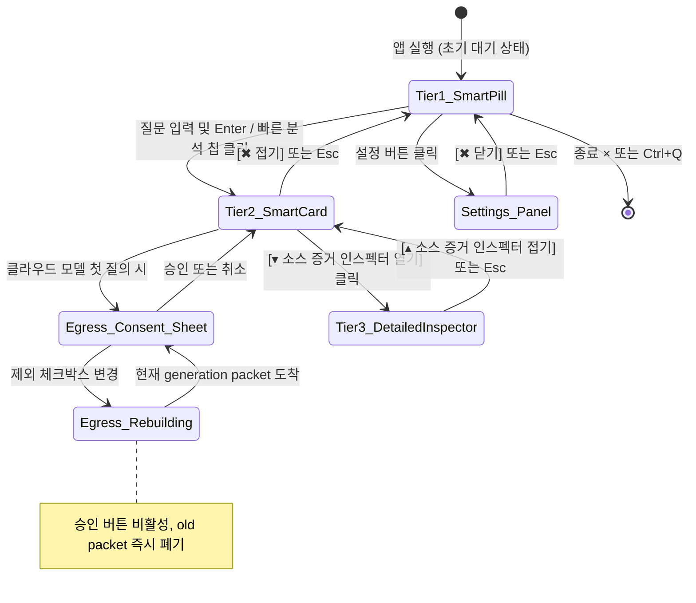

# Code Mentat UI/UX Design Specification (designs.md)
## 코드 멘타트 디자인 명세서

- **문서 버전:** 1.2.0
- **표준 규격:** AI Implementation Documentation Standard Section 5
- **기준 작성일:** 2026-08-18 (최종 갱신: 2026-08-19)
- **동결:** 아래 뷰포트·토큰·단축키는 현재 제품 구현을 기준으로 한다 (IMP-F003).

---

## 1. 핵심 경험 및 제품 철학

Code Mentat의 UI는 **"개발자의 집중을 방해하지 않는 초경량 지능형 조언자"**를 지향합니다.
대형 IDE 창이나 무거운 도구 대신, 화면 상단 또는 모서리에 상주하는 초소형 위젯(Smart Pill)으로 시작하여 필요 시에만 점진적으로 확장(Progressive Disclosure)됩니다.

---

## 2. 전체 화면 흐름도 (Screen Flow & State Transitions)



---

## 3. 계층별 상세 레이아웃 구조 (ASCII Architecture)

### 3.1 Tier 1: Smart Pill (컴팩트 상주 모드 - `760x56px`)
```text
+------------------------------------------------------------------------------------------------------------------+
| CODE MENTAT | [저장소: CodeMent…] [R/O] | [질문 또는 /onboard 입력...] [/onboard] |[고정][설정][종료 ×]|
+------------------------------------------------------------------------------------------------------------------+
```

### 3.2 Tier 2: Smart Card (질문 및 요약 모드 - `760x360px`)
```text
+-----------------------------------------------------------------------------------------------+
| [R/O] [저장소: CodeMentat] | [/structure                         ] | [/onboard] [고정] [설정] |
+-----------------------------------------------------------------------------------------------+
| 빠른 분석: [/onboard] [/structure] [/conflicts] [스트리밍 취소 (Esc)]                [접기 (Esc)] |
|-----------------------------------------------------------------------------------------------|
| 분석 결과: 이 프로젝트는 10개 크레이트로 구성된 Cargo Workspace 구조입니다.                         |
|                                                                                               |
|  [OBSERVED] 10개 독립 크레이트 선언됨                                                          |
|    └─ Cargo.toml 매니페스트 관찰                                                               |
|                                                                                               |
|  [CONFLICT] Cargo.toml 버전 (0.1.0) vs CHANGELOG (1.0.0)                                       |
|    └─ 영향: 릴리스 메타데이터 불일치                                                          |
|                                                                                               |
| [답변 복사] [▾ 소스 증거 인스펙터 열기]                                                      |
+-----------------------------------------------------------------------------------------------+
```

### 3.3 Tier 3: Detailed Evidence & File Inspector (`900x620px`)
```text
+-----------------------------------------------------------------------------------------------+
| [Tier 1 & Tier 2 요약 영역]                                                                   |
|-----------------------------------------------------------------------------------------------|
| Detailed Evidence & File Inspector                                                            |
| +------------------------------------+------------------------------------------------------+ |
| | 저장소 파일 트리                   | 소스코드 행 뷰어                                     | |
| |  > Cargo.toml (42행) [선택됨]      |  1 | [workspace]                                    | |
| |  > crates/mentat-core/src/lib.rs   |  2 | members = [                                    | |
| |  > crates/mentat-app/src/app.rs    |  3 |     "crates/mentat-core",                      | |
| |  > README.md                       |  4 |     "crates/mentat-repository",                | |
| +------------------------------------+------------------------------------------------------+ |
| [답변 복사] [▴ 소스 증거 인스펙터 접기]                                                      |
+-----------------------------------------------------------------------------------------------+
```

---

## 4. 디자인 토큰 정의 (Design Tokens)

| 토큰명 | 색상 값 (HEX / RGB) | 용도 |
|---|---|---|
| `BG_BASE` | `#FFFFFF` (255, 255, 255) | 불투명 위젯 메인 배경 |
| `BG_CARD` | `#F5F5F2` (245, 245, 242) | 내부 카드 및 그룹 박스 배경 |
| `BG_INPUT` | `#FFFFFF` (255, 255, 255) | 질문·설정 입력 배경 |
| `BORDER_COLOR` | `#CFCFCB` (207, 207, 203) | 프레임 및 구분선 보더 |
| `BORDER_FOCUS` | `#B91C1C` (185, 28, 28) | 키보드 포커스 및 주의 동작 |
| `TEXT_PRIMARY` | `#111111` (17, 17, 17) | 본문 및 주 타이틀 |
| `TEXT_MUTED` | `#525252` (82, 82, 82) | 캡션, 보조 설명, 플레이스홀더 |
| `STATUS_READ_ONLY` | `#166534` (22, 101, 52) | `[OBSERVED]` 및 읽기전용 안전 상태 |
| `STATUS_INFERENCING` | `#1D4ED8` (29, 78, 216) | `[INFERRED]` 및 스트리밍 진행 상태 |
| `STATUS_CONFLICT` | `#92400E` (146, 64, 14) | `[CONFLICT]` 및 경고 |
| `STATUS_ERROR` | `#B91C1C` (185, 28, 28) | 오류와 프로그램 종료 동작 |

---

## 5. UI 버튼 및 상호작용 정책 (CTA & Interactive Policies)

1. **저장소 열기 버튼:** 클릭 시 OS 네이티브 폴더 선택 다이얼로그 호출 후 `ReadOnlySession::open()` 실행.
2. **질문 전송 (`Enter` 또는 `/`):**
   - 로컬 슬래시 명령(`/onboard`, `/structure`, `/conflicts`): 즉시 로컬 실행 (<10ms).
   - 일반 자연어 질의: 클라우드 설정 확인 후 Egress Sheet 노출 또는 실시간 스트리밍 시작.
   - 제외 체크박스 변경: Consent Sheet는 유지하되 승인을 비활성하고 "제외 반영 중"을 표시한다. 새 generation packet이 도착하기 전에는 승인할 수 없다.
3. **Always-on-Top 고정 버튼:** 토글 시 `WindowLevel::AlwaysOnTop` ↔ `WindowLevel::Normal` 전환.
4. **스트리밍 즉시 취소 (`Esc` 또는 `[스트리밍 취소]`):** 비동기 `CancellationToken` 호출로 100ms 내 스트림 즉각 중단.
5. **계층 축소 (`Esc`):** Tier 3 → Tier 2 → Tier 1 단계별 접기.
6. **질문 포커스 (`/` 또는 `Ctrl+K`):** 입력창에 포커스를 준다.
7. **핀 토글 (`Ctrl+P`):** Always-on-Top을 전환한다.
8. **전역 표시·포커스 (`Alt+Space`, `Ctrl+Alt+M`):** OS 전역 단축키로 등록해 다른 앱에서 Code Mentat를 표시·포커스하고 Tier 1로 접는다. hidden 창의 self-unhide를 보장할 수 없으므로 `Visible(false)`는 사용하지 않으며, 등록 실패 시 focused shortcut도 Tier 1 접기만 수행한다.
9. **인덱싱 취소:** 스캔 중 `[인덱싱 취소]`로 `ScanOutcome` 취소를 요청하고, 누락 사유(FileTooLarge/TotalBytesLimit/FileCountLimit/Cancelled)를 표시한다.
10. **프로그램 종료 (`종료 ×` 또는 `Ctrl+Q`):** 추론·인덱싱을 취소하고 현재 동의 조립과 비동기 수신 상태를 폐기한 뒤 창을 종료한다. 설정 헤더의 버튼은 `패널 닫기`로 표기해 이 동작과 구분한다.

## 6. 글꼴·아이콘·뷰포트 복구 기준

1. 한국어 UI 문자열은 운영체제 설치 글꼴에 의존하지 않고, 애플리케이션에 포함된 OFL 한글 글꼴을 비례·고정폭 글꼴군의 폴백으로 등록한다.
2. 핵심 조작 아이콘은 색상 이모지 글꼴에 의존하지 않는 텍스트 또는 기본 벡터 도형으로 표시한다. 따라서 폴더 열기, 읽기 전용 상태, 빠른 분석, 고정, 설정, 닫기 조작은 지원되지 않는 이모지 때문에 사각형 글리프로 바뀌지 않아야 한다.
3. 질문 제출과 빠른 분석은 저장소 준비 여부와 무관하게 Tier 2를 먼저 열어 결과 또는 선행조건 오류를 사용자가 볼 수 있게 한다.
4. 설정 패널을 열면 최소 Tier 2 높이로 확장하고, 닫을 때 기존 대화 결과가 없으면 Tier 1로 복귀한다.
5. Tier 1의 입력창은 최소 200pt의 편집 폭을 확보하며, 좁은 창에서는 보조 빠른 분석 칩을 숨겨 핵심 저장소·질문·설정·종료 조작을 보존한다.
6. 화면은 8pt 간격 그리드, 1px 구분선, 2~4px 모서리 반경을 사용한다. 장식용 그림자·그라데이션·반투명 표면은 사용하지 않는다.
7. 본문은 최소 14pt, 보조 문구는 최소 13pt를 사용하며 모든 widget state의 전경색을 명시한다.
8. Tier 1 우측 180pt는 고정 trailing 영역이며 `고정`·`설정`·`종료 ×` 외의 요소가 침범하지 않는다. 저장소 버튼은 최대 120pt, 한 줄, width-based ellipsis이며 hover 시 전체 저장소 이름을 표시한다.
9. 640px에서는 `/onboard` 보조 칩을 숨기고 저장소 버튼을 축소해 질문 입력 200pt와 trailing hit target을 보존한다. 760px에서는 동일 안전 영역을 유지하면서 여유가 있으면 보조 칩을 표시한다.

## 7. AI 공급자 설정 및 활성화 흐름

```text
+------------------------------------------------------------------+
| 1. 공급자 선택 [Gemini / OpenRouter / OpenAI / Custom / 내장 로컬] |
| 2. Base URL + API Key(필요한 공급자만)                              |
|    [API 확인 및 모델 불러오기]                                     |
| 3. 공급자가 반환한 모델 선택 [동적 목록]                            |
|    [선택 모델 호환성 확인]                                         |
| 4. 검증 프로필과 Draft가 동일할 때만 [활성화]                       |
| 상태: Draft / ModelsDiscovered / ModelVerified / Active           |
+------------------------------------------------------------------+
```

1. 모델 콤보박스는 코드의 프리셋이 아니라 현재 자격 증명으로 조회된 모델만 표시한다.
2. 목록 조회 실패 또는 빈 목록은 명시적인 오류 상태이며 임의 모델로 대체하지 않는다.
3. 공급자·URL·API 키 변경 시 2단계부터, 모델 변경 시 3단계부터 다시 검증한다.
4. 내장 로컬은 항상 공급자 선택지에 표시하지만 실행 엔진이나 설치 모델이 없으면 이유를 표시하고 활성화 버튼을 비활성한다.
5. Active 프로필은 설정 편집 중인 Draft와 분리하며, 활성화 전에는 기존 Active 프로필이 계속 사용된다.
6. 공급자 설정 패널은 `760x480px`이며 모델 검색·검증·활성화 상태와 오류 메시지가 잘리지 않아야 한다.
