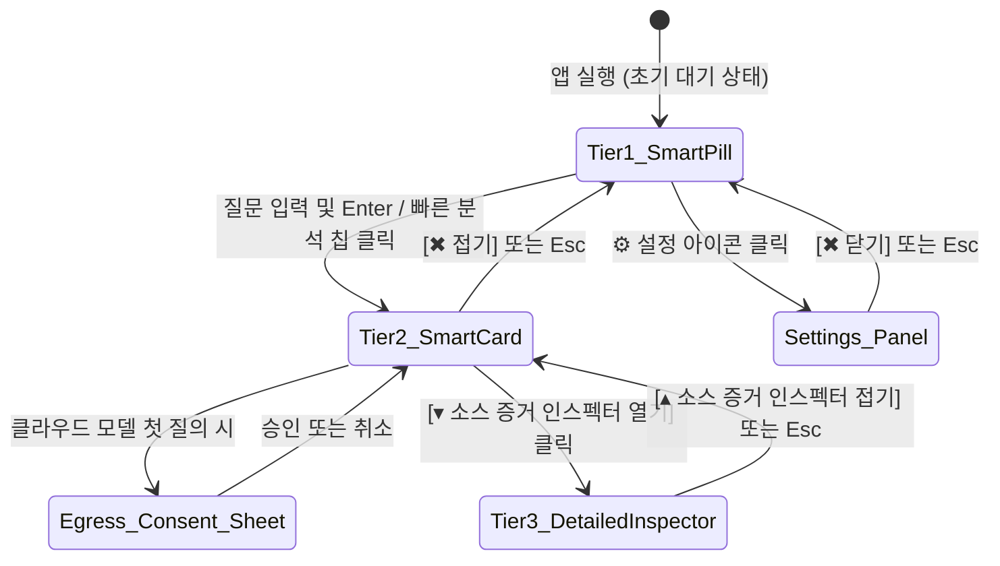

# Code Mentat UI/UX Design Specification (designs.md)
## 코드 멘타트 디자인 명세서

- **문서 버전:** 1.0.0
- **표준 규격:** AI Implementation Documentation Standard Section 5
- **기준 작성일:** 2026-08-18

---

## 1. 핵심 경험 및 제품 철학

Code Mentat의 UI는 **"개발자의 집중을 방해하지 않는 초경량 지능형 조언자"**를 지향합니다.
대형 IDE 창이나 무거운 도구 대신, 화면 상단 또는 모서리에 상주하는 초소형 위젯(Smart Pill)으로 시작하여 필요 시에만 점진적으로 확장(Progressive Disclosure)됩니다.

---

## 2. 전체 화면 흐름도 (Screen Flow & State Transitions)



---

## 3. 계층별 상세 레이아웃 구조 (ASCII Architecture)

### 3.1 Tier 1: Smart Pill (컴팩트 상주 모드 - `580x48px`)
```text
+-----------------------------------------------------------------------------------------------+
| [🟢] [📁 CodeMentat (v0.1.0)] | [🔍 질문 또는 /onboard 입력...     ] | [⚙️] [📌] [⚡준비됨] |
+-----------------------------------------------------------------------------------------------+
```

### 3.2 Tier 2: Smart Card (질문 및 요약 모드 - `580x280px`)
```text
+-----------------------------------------------------------------------------------------------+
| [🟢] [📁 CodeMentat (v0.1.0)] | [🔍 /structure                     ] | [⚙️] [📌] [⚡인덱싱됨] |
+-----------------------------------------------------------------------------------------------+
| ⚡ 빠른 분석: [/onboard] [/structure] [/conflicts] [⏹️ 스트리밍 취소 (Esc)]          [✖ 접기 (Esc)] |
|-----------------------------------------------------------------------------------------------|
| 🤖 분석 결과: 이 프로젝트는 10개 크레이트로 구성된 Cargo Workspace 구조입니다.                      |
|                                                                                               |
|  [OBSERVED] 10개 독립 크레이트 선언됨                                                          |
|    └─ Cargo.toml 매니페스트 관찰                                                               |
|                                                                                               |
|  [CONFLICT] Cargo.toml 버전 (0.1.0) vs CHANGELOG (1.0.0)                                       |
|    └─ 영향: 릴리스 메타데이터 불일치                                                          |
|                                                                                               |
| [📋 답변 복사] [▾ 소스 증거 인스펙터 열기]                                                    |
+-----------------------------------------------------------------------------------------------+
```

### 3.3 Tier 3: Detailed Evidence & File Inspector (`640x460px`)
```text
+-----------------------------------------------------------------------------------------------+
| [Tier 1 & Tier 2 요약 영역]                                                                   |
|-----------------------------------------------------------------------------------------------|
| 🔬 Detailed Evidence & File Inspector                                                         |
| +------------------------------------+------------------------------------------------------+ |
| | 📂 저장소 파일 트리                | 📄 소스코드 행 뷰어                                  | |
| |  > Cargo.toml (42행) [선택됨]      |  1 | [workspace]                                    | |
| |  > crates/mentat-core/src/lib.rs   |  2 | members = [                                    | |
| |  > crates/mentat-app/src/app.rs    |  3 |     "crates/mentat-core",                      | |
| |  > README.md                       |  4 |     "crates/mentat-repository",                | |
| +------------------------------------+------------------------------------------------------+ |
| [📋 답변 복사] [▴ 소스 증거 인스펙터 접기]                                                    |
+-----------------------------------------------------------------------------------------------+
```

---

## 4. 디자인 토큰 정의 (Design Tokens)

| 토큰명 | 색상 값 (HEX / RGB) | 용도 |
|---|---|---|
| `BG_BASE` | `#0F172A` (Slate-900) | 위젯 메인 배경 |
| `BG_CARD` | `#1E293B` (Slate-800) | 내부 카드 및 그룹 박스 배경 |
| `BORDER_COLOR` | `#334155` (Slate-700) | 프레임 및 구분선 보더 |
| `TEXT_PRIMARY` | `#F8FAFC` (Slate-50) | 본문 및 주 타이틀 |
| `TEXT_MUTED` | `#94A3B8` (Slate-400) | 캡션, 보조 설명, 플레이스홀더 |
| `STATUS_READ_ONLY` | `#10B981` (Emerald-500) | `[OBSERVED]` 및 읽기전용 안전 상태 |
| `STATUS_INFERENCING` | `#38BDF8` (Sky-400) | `[INFERRED]` 및 스트리밍 진행 상태 |
| `STATUS_CONFLICT` | `#EF4444` (Red-500) | `[CONFLICT]` 및 오류/경고 상태 |

---

## 5. UI 버튼 및 상호작용 정책 (CTA & Interactive Policies)

1. **폴더 열기 버튼 (`[📁]`):** 클릭 시 OS 네이티브 폴더 선택 다이얼로그 호출 후 `ReadOnlySession::open()` 실행.
2. **질문 전송 (`Enter` 또는 `/`):**
   - 로컬 슬래시 명령(`/onboard`, `/structure`, `/conflicts`): 즉시 로컬 실행 (<10ms).
   - 일반 자연어 질의: 클라우드 설정 확인 후 Egress Sheet 노출 또는 실시간 스트리밍 시작.
3. **Always-on-Top 고정 버튼 (`[📌]`):** 토글 시 `WindowLevel::AlwaysOnTop` ↔ `WindowLevel::Normal` 전환.
4. **스트리밍 즉시 취소 (`Esc` 또는 `[⏹️ 취소]`):** 비동기 `CancellationToken` 호출로 100ms 내 스트림 즉각 중단.
5. **계층 축소 (`Esc`):** Tier 3 → Tier 2 → Tier 1 단계별 접기.
